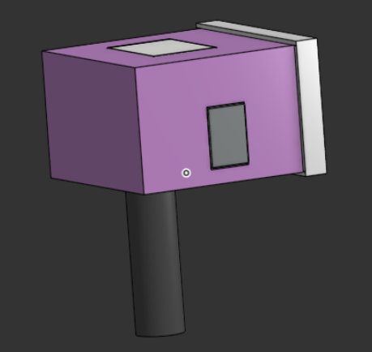
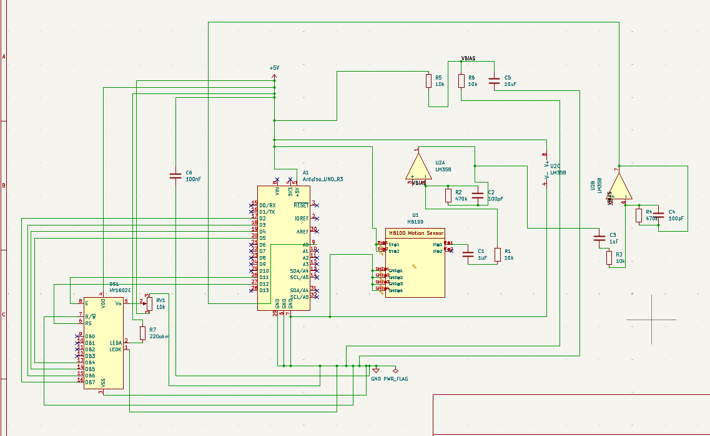
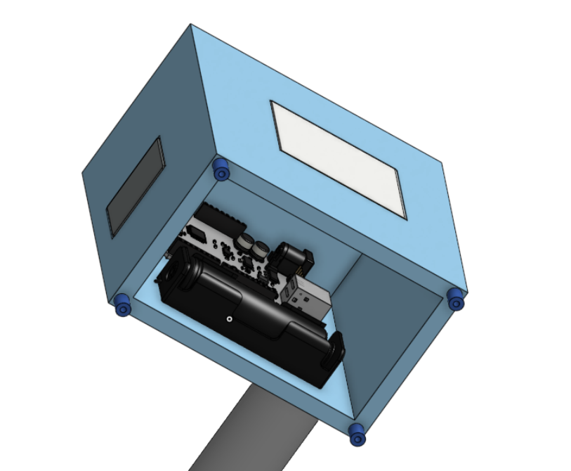
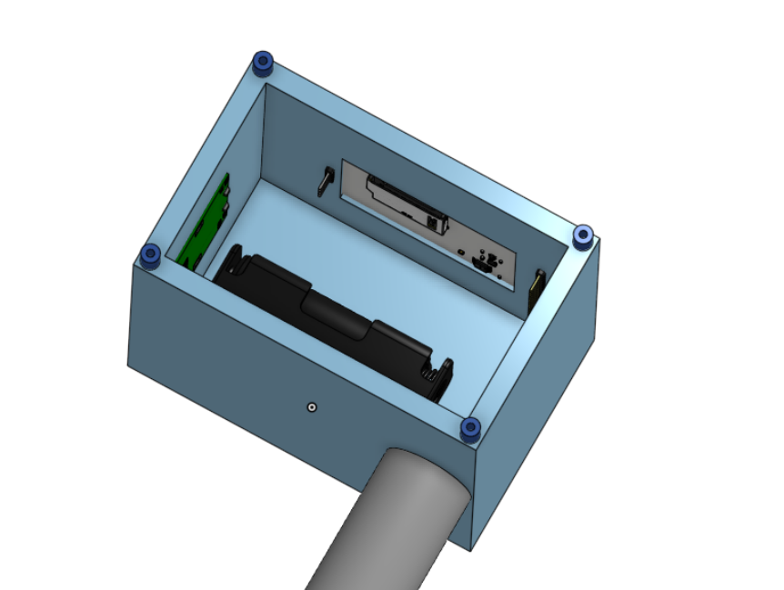
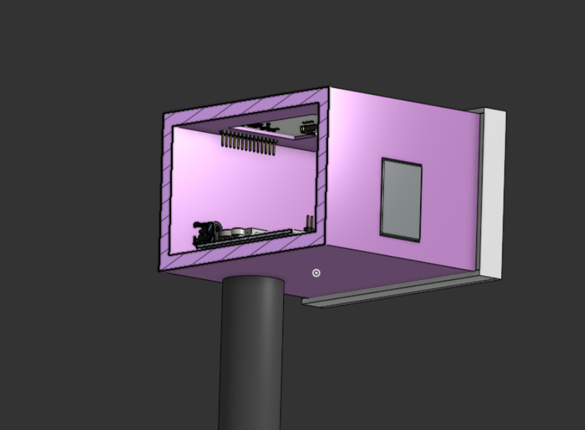

# Pomodoro Lockbox
A focus timer that physically locks away your phone for the session 
duration and releases it when the session completes.

## How it works
The enclousure houses an Arduino UNO with a HB100 sensor to detect the frequency. It also has a TFT LCD screen to view the speed. It takes in the values from the sensor and passes it to an OP-AMP to amplify it and then pass it to arduino to compute it and display it on the screen.

## Why I built it
[TO EDIT]

## Usage
[TO EDIT]

## Hardware
- BOM with total cost: see [BOM.csv](BOM.csv)
- Schematic: see [hardware/kicad/Circuitofdoppergun.pdf](hardware/kicad/Circuitofdoppergun.pdf)
- 

## CAD
- Onshape (live): [[link](https://cad.onshape.com/documents/bee782b7c366405308526efb/w/6c652c306751b53aee4521c4/e/edf4804fac8ad89728f04d54?renderMode=0&uiState=6a1ed76c2cf0ccb79e853825)]
- STEP files: [hardware/enclosure](hardware/enclosure)

## Firmware
[TO EDIT]

### Flashing
[TO EDIT]

Pin map: see [firmware/pinmap.md](firmware/pinmap.md)

## Replication
[TO EDIT]
### Step 1 - Order the Components
Order all the components listed in the BOM

---

### Step 2 - Solder and Populate
Populate the core components, motor driver, connectors, and sensor headers.

---

### Step 3 - Flash the Firmware
Flash according to the Flashing guide above

---

### Step 4 - 3D Print
- **Material:** PLA works well.3d print the enclosure. **ALSO CHANGE THE DIMENSIONS TO SUIT YOUR PHONE SIZE**

---

### Step 5 - Final Assembly
Mount the components in the case, wire the servo and power, and connect sensors.

---

## License
MIT
